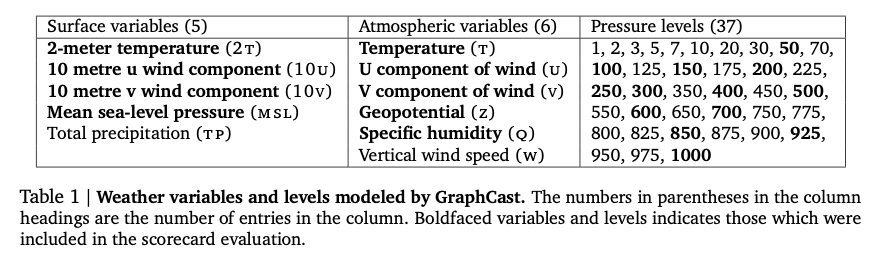
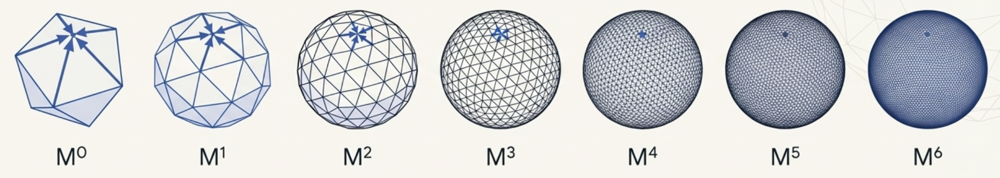
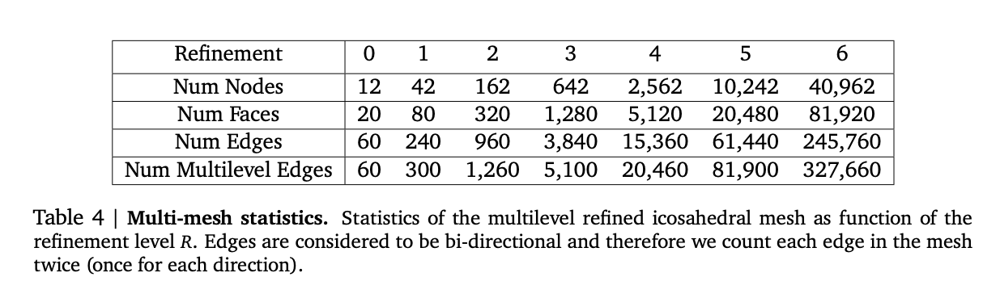

# GraphCast

GraphCast is a one-step learned simulator that takes the role of $\phi$ and predicts the next step based on two consecutive input states.

$$X_{t+1} = \text{GraphCast}(X_t, X_{t-1})$$

$$X_{t+1:t+T} = (\text{GraphCast}(X_t, X_{t-1}), \text{GraphCast}(\hat{X}_{t+1}, X_t), \dots, \text{GraphCast}(\hat{X}_{t+T-1}, \hat{X}_{t+T-2}))$$

**Design rationale:** Two input states were found to yield better performance than one, while three consecutive states did not provide sufficient improvement to justify the increased memory footprint.

---
layout: default
---

# Physical Variables

- GraphCast models weather variables over multiple vertical levels
- **Surface variables (5):** Temperature, wind components, sea-level pressure, precipitation
- **Atmospheric variables (6):** Temperature, wind, geopotential, humidity, vertical wind
- **37 pressure levels** for vertical atmospheric coverage
- These variables are fundamental to representing the atmospheric state accurately for medium-range forecasting

---
layout: default
---

# GraphCast Components: Grid Nodes

### Grid node representation

Each grid node represents a vertical slice of the atmosphere at a given latitude-longitude point.

At **0.25° resolution**, there is a total of **721 × 1440 = 1,038,240 grid nodes**.

Each grid node has **474 input features**, computed as follows:
- ($5$ surface variables + $6$ atmospheric variables $\times 37$ levels) $\times 2$ steps
- + $5$ forcings $\times 3$ steps
- + $5$ constants

---
layout: default
---

# Mesh Nodes (Refinement Levels)

- Placed uniformly around the globe in an R-refined icosahedral mesh $M_R$
- Iteratively refined $M_r \rightarrow M_{r+1}$ by splitting each triangular face into 4 smaller faces
- GraphCast refines the mesh $R=6$ times to obtain $M_6$
- **40,962 mesh nodes** at full refinement level
- Each mesh node contains **3 input features**

---
layout: default
transition: fade-out
---

# Mesh Edges

- **Bidirectional edges** added between mesh nodes that are connected in the mesh
- Enables communication between adjacent mesh nodes
- Total of **327,660 mesh edges**
- Each edge has **4 input features**
- Forms the core of the mesh graph structure

---
layout: default
transition: fade-out
---

# Grid2Mesh Edges (Grid → Mesh)

- **Unidirectional edges** connecting grid nodes to mesh nodes
- An edge is added if the distance $\le 0.6 \times$ the length of edges in $M_6$
- Ensures every grid node is connected to at least one mesh node
- Enables transfer of atmospheric state information from grid to mesh
- Total of **1,618,746 Grid2Mesh edges**
- Each edge has **4 input features**

---
layout: default
transition: fade-out
---

# Mesh2Grid Edges (Mesh → Grid)

- **Unidirectional edges** connecting mesh nodes back to grid nodes
- For each grid point, find the triangular face in $M_6$ that contains it
- Add three Mesh2Grid edges to the three adjacent mesh nodes of that face
- Enables transfer of processed information from mesh back to grid
- Total of **3,114,720 Mesh2Grid edges**
- Each edge has **4 input features**

---
layout: image-right
image: images/arch-overview.png
backgroundSize: contain
---

# GraphCast Architecture Overview

Standard Encode-Process-Decode architecture:

1. **Encoder:** Projects input data to latent representations on a multi-mesh
2. **Processor:** A deep GNN representing learned message-passing on the multi-mesh
3. **Decoder:** Brings information back to the grid and computes output

---
layout: image-right
image: images/encoder.png
backgroundSize: 80%
---

# Phase 1: The Encoder

**Goal:** Prepare data into latent representations for the processor (run exclusively on the multi-mesh).

- **Feature Embedding:** Embed features of grid nodes, mesh nodes, and edges into a fixed-size latent space using 5 MLPs
- **Grid2Mesh GNN:** Transfers atmospheric state information from grid nodes to mesh nodes via a single message-passing step

---
layout: default
---

# Phase 2: The Processor

**Deep GNN operating on the Mesh subgraph $G_M(V_M, E_M)$**

The mesh edges contain the full multi-mesh ($M_0$ through $M_6$) to enable long-distance communication.

### Multi-Mesh GNN Architecture

Iteratively applied **16 times** using unshared MLP weights:

1. **Update mesh edges** using information of adjacent nodes
2. **Update mesh nodes**, aggregating information from all edges
3. **Residual connection** applied to updated representations

---
layout: image-right
image: images/decoder.png
backgroundSize: 80%
---

# Phase 3: The Decoder

**Goal:** Bring information back to the grid and extract an output.

### Mesh2Grid GNN
Performs a single message-passing step over the Mesh2Grid bipartite subgraph:
1. Updates each Grid2Mesh edge using adjacent node information
2. Updates each grid node, aggregating incoming edge information

### Output Function
- Produces per-node predictions $\hat{y}_i$ using an MLP (227 variables)
$$hat{X}_{t+1} = X_t + hat{Y}_t$$